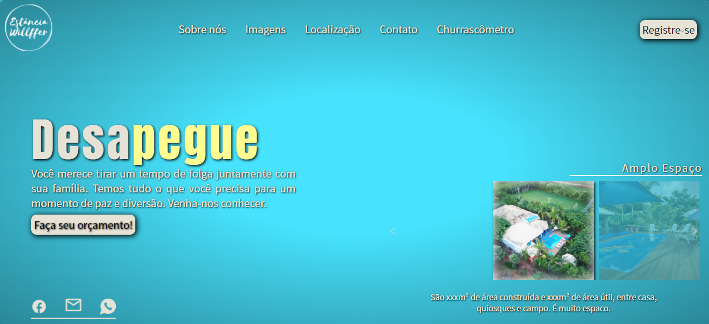

# estancia-v2

- Site 'modelo' de um Resort. Peguei como referência, a chácara dos meus pais. Desenvolvido em JadaScript e totalmente responsivo.

## Tecnologias utilizadas:

- JavaScript
- HTML5
- CSS3

